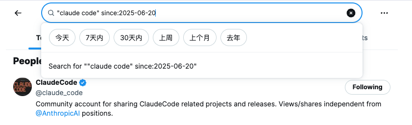

# My User Scripts

## What's User Script

用户脚本是一种可以在网页上运行的小型JavaScript程序，通过浏览器扩展（如 [Tampermonkey](https://chromewebstore.google.com/detail/%E7%AF%A1%E6%94%B9%E7%8C%B4/dhdgffkkebhmkfjojejmpbldmpobfkfo) 又叫油猴或篡改猴）来增强或修改网页功能。用户可以通过这些脚本自定义网页行为，添加新功能，改善用户体验。

## List

### Twitter/X 搜索日期快捷按钮

在 Twitter/X 搜索框下方添加日期筛选快捷按钮。

download👇 
https://greasyfork.org/en/scripts/540701-twitter-x-%E6%90%9C%E7%B4%A2%E6%97%A5%E6%9C%9F%E5%BF%AB%E6%8D%B7%E6%8C%88%E9%92%AE

### NPMJS Absolute Timestamp

将 npmjs.com 上的相对时间戳（如 "2 days ago"）转换为绝对日期显示。

### Clean Tracking Query

自动移除 URL 中的 utm_*、gclid、fbclid 等常见追踪参数，保护隐私并简化链接。

### ChangeLog Navigation

在 Changelog.com 的邮件页面标题下方显示带标题的分页导航，方便浏览前后文章。

### npmjs file downloader

在 npmjs.com 的 Code 页目录树中，为每个文件名旁添加「下载」按钮，方便直接下载单个文件。

## License

MIT.
